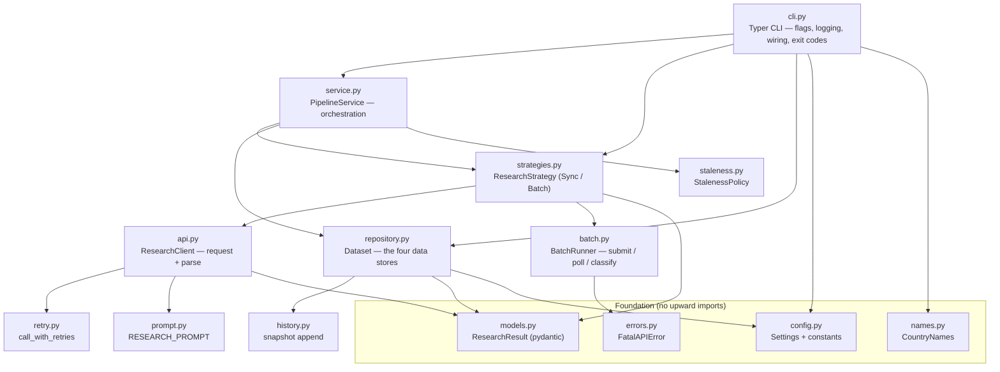
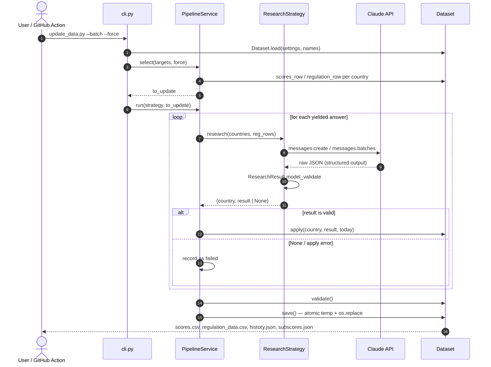
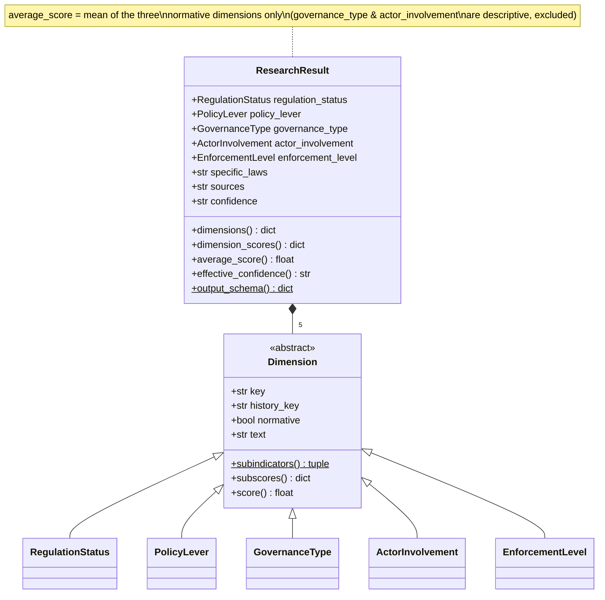
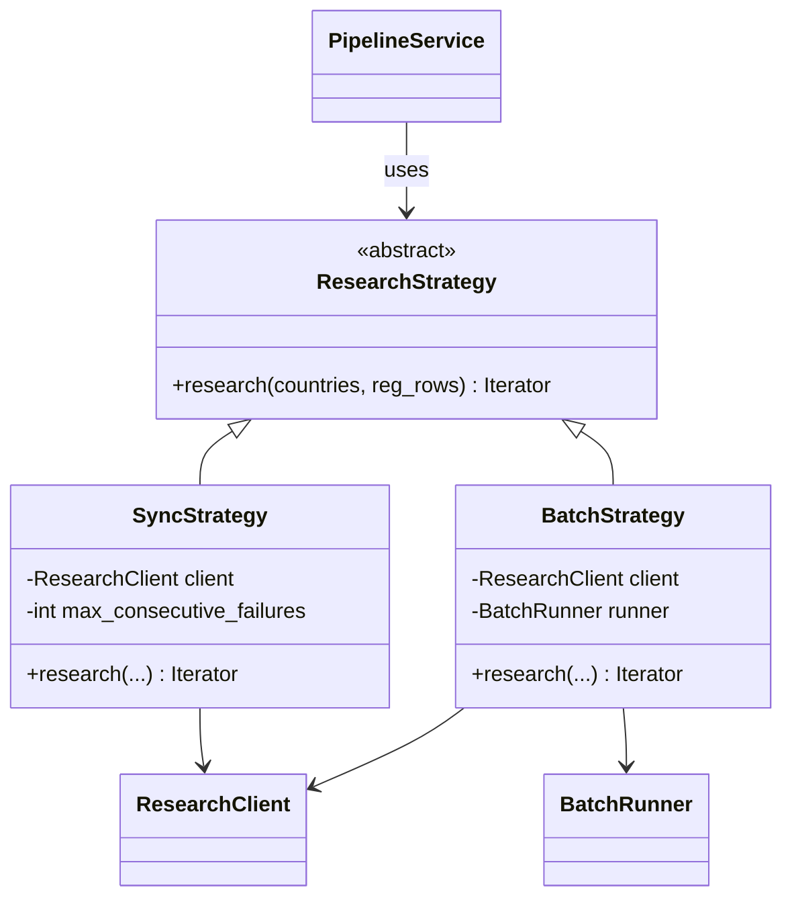
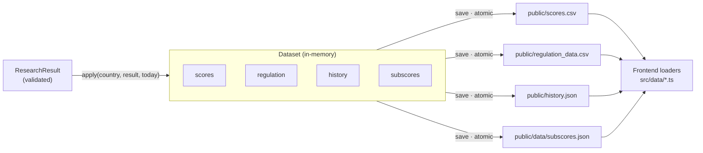
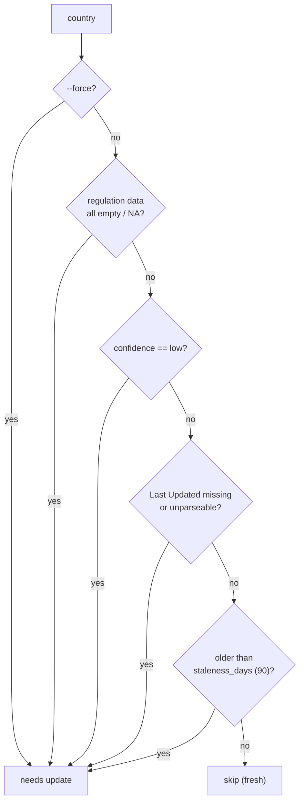
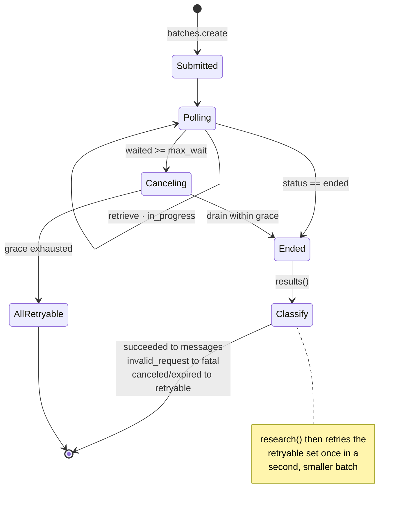
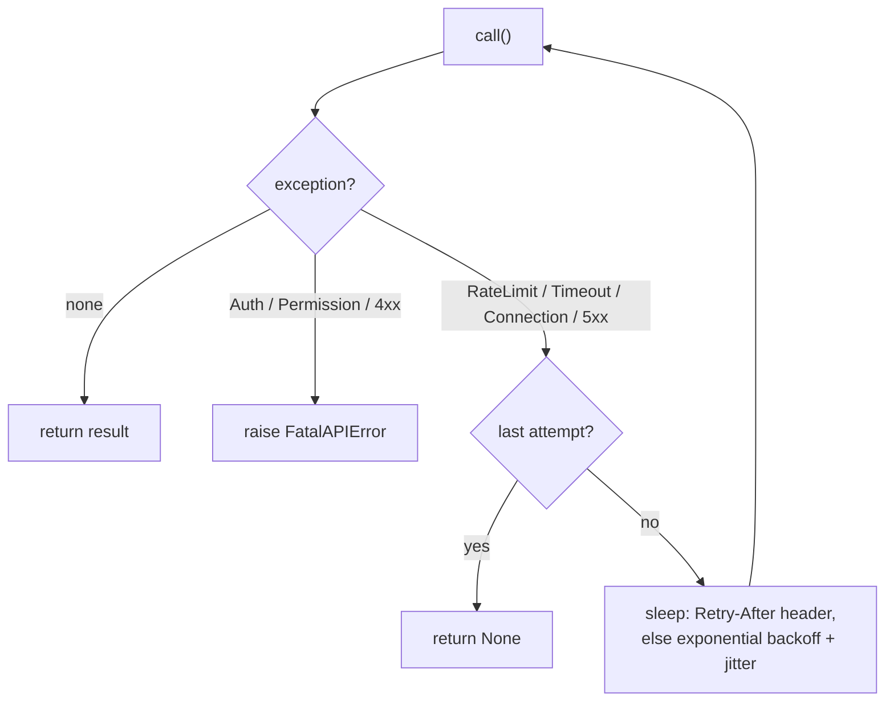

# `regulation_pipeline` — backend architecture

The pipeline researches AI-regulation status for every country via the Claude API
and writes the four data files the frontend renders. It runs monthly from GitHub
Actions and on demand from the CLI.

```bash
python scripts/update_data.py --force --batch      # full run, 50% token pricing
python scripts/update_data.py --countries "Germany,France"
python scripts/update_data.py --dry-run --force    # preview, no writes
python -m regulation_pipeline --help               # (or: update-regulation-data, after pip install -e .)
```

The package is layered around a few classic patterns — **domain model**,
**repository**, **strategy**, and a **service** orchestrator — so each concern has
one home and is testable in isolation. Everything below reflects the code in this
directory.

---

## Layered architecture

Arrows mean *depends on / calls*. The top is the entry point; the bottom is the
shared foundation. Nothing in the foundation imports upward.



### Module map

| Module | Responsibility |
|--------|----------------|
| `cli.py` | Typer command: flags, logging setup, dependency wiring, exit codes |
| `service.py` | `PipelineService` — select → research → validate → persist |
| `strategies.py` | `ResearchStrategy` ABC + `SyncStrategy` / `BatchStrategy` |
| `api.py` | `ResearchClient` — build request params, parse the response |
| `batch.py` | `BatchRunner` — Message Batches submit/poll/classify + salvage |
| `retry.py` | Reusable transient-error retry policy |
| `prompt.py` | The research prompt template + rendering |
| `models.py` | `ResearchResult` pydantic model — schema, validation, projections |
| `repository.py` | `Dataset` — load/apply/validate/atomic-save the four stores |
| `history.py` | History snapshot append + change detection |
| `staleness.py` | `StalenessPolicy` — which countries need re-research |
| `names.py` | `CountryNames` — country-name normalization |
| `config.py` | `Settings` (repo-root paths) + field/threshold/priority constants |
| `errors.py` | `FatalAPIError` |

---

## End-to-end run

A single run, from invocation to written files. The strategy is a **generator**,
so each answer is validated and committed as it arrives — which is what lets a
fatal abort still save the countries completed so far.



Exit codes: `0` success, `1` some countries failed, `2` fatal (systemic) — with
partial progress saved.

---

## Domain model

`ResearchResult` is the **single source of truth**: it generates the
structured-output JSON schema handed to the API, validates responses, and computes
every projection (dimension means, maturity composite, confidence). Each dimension
is four named sub-indicators (integers 1–5); the dimension score is their mean.



Scores are typed `Literal[1..5]` (rendered as an `enum` in the schema, since
structured outputs don't support `minimum`/`maximum`) with a `BeforeValidator` that
rejects booleans — so a malformed response raises instead of landing an empty CSV
cell.

---

## Strategy pattern

Two interchangeable research backends behind one generator interface. The service
never branches on sync-vs-batch — it just consumes `(country, result | None)`.



- **`SyncStrategy`** — one call per country; aborts the run (`FatalAPIError`) after
  N consecutive failures of *any* kind (transient, unparseable, or schema-invalid).
- **`BatchStrategy`** — submits all countries at once (50% token pricing); per-request
  results mean a bad country costs one country, not the run — so there is no
  consecutive-failure abort.

---

## Repository and the data contract

The four stores always travel together, so one object owns them. `apply` folds a
validated result into all four; `save` writes them **atomically** (temp file +
`os.replace`) so an interrupted run can't leave a half-written file.



> **Byte-format is a contract.** CSVs use the csv module's `\r\n`; the JSON files
> have no trailing newline; `subscores.json` is `sort_keys=True`; `history.json`
> preserves snapshot key order. An unchanged run re-writes every file byte-for-byte
> identically (there's a test that asserts exactly this). Preserve this when
> touching `repository.py`.

---

## Staleness selection

`PipelineService.select` filters the target countries through `StalenessPolicy`
before any API call — the reference date is injected so a run has one consistent
"today".



---

## Batch lifecycle

`BatchRunner` submits, polls to completion, and classifies each result. On timeout
it **cancels and salvages** the requests that already succeeded (and were already
billed) instead of discarding the run.



---

## Retry policy

`call_with_retries` wraps a single API call. The SDK's own retries are disabled
(`max_retries=0`) so these are the only attempts and every one is logged.



`Retry-After` is honored on **every** retryable error, including 5xx/overloaded.

---

## Supabase layer (`db/`) and the evidence layer (`evidence/`)

The static files stay the persistence contract (everything above is
unchanged); Supabase is the system of record's queryable twin plus what files
can't hold — evidence records, an accumulating sources database, and per-run
provenance.

- **Mirror (`db/mirror.py`)** — an optional collaborator of
  `PipelineService` (`mirror=` constructor arg), deliberately OUTSIDE
  `Dataset` so the byte contracts and the idempotency test are untouched.
  The service calls `begin(attempted)` before researching, `record(...)`
  after each successful apply, and `finish(...)` after `dataset.save()`
  (including the fatal-error partial-save path) — every call wrapped so a
  mirror failure downgrades to a warning and can never change a run's
  outcome or exit code. The flush upserts `country_scores` /
  `country_summaries`, REPLACES `score_history` per recorded country
  (`history.py` mutates the last snapshot's date in place, so append-only
  would drift), and feeds every cited URL into `sources` /
  `country_sources` with the run id. `research_runs` records trigger,
  model, strategy, prompt version, grounded flag, git SHA, counts, and
  cumulative token usage.
- **Client (`db/client.py`)** — a thin httpx PostgREST wrapper (select /
  insert / upsert / update / delete), testable with `httpx.MockTransport`.
  Upserts must never include generated columns like `id` —
  merge-duplicates updates every supplied column.
- **Seed (`db/seed.py`)** — one-shot bootstrap from the static files:
  `--emit-sql DIR` writes chunked idempotent SQL (FKs resolved by
  name/url subselects), `--direct` applies via PostgREST.
- **Evidence (`evidence/`)** — `OecdGaiinAdapter` walks the OECD.AI Policy
  Navigator API (no server-side filtering exists; delta detection is
  client-side against `updated_at`), `CountryResolver` matches ISO3 →
  canonical name → None (never fuzzy; unmatched records are stored
  unlinked with the raw label), and `sync.py` upserts on
  `(source, external_id)` — never deleting. CLI:
  `python -m regulation_pipeline.evidence probe|sync`. A network failure
  is a warned no-op so the surrounding data run survives an OECD outage.
- **Grounded mode** — `prompt.render_grounded_prompt` injects a capped
  verified-evidence block (≤15 most recent initiatives, overviews ≤400
  chars); the rubric and structured-output schema are identical to the
  plain prompt, so `models.py` and everything downstream are untouched.
  `ResearchClient` takes an `evidence_provider`; countries without
  evidence fall back to the plain prompt. Enable with `--grounded`.

## Testing & tooling

```bash
python -m pytest        # tests/pipeline/ — 90+ tests, no network (fakes throughout)
ruff check scripts/regulation_pipeline
pip install -e .        # installs the package + update-regulation-data console script
```

Every layer has a seam for testing: `Settings(root=tmp_path)` redirects all I/O,
strategies take a stub `ResearchClient`, the batch poll loop takes an injected
`sleep`, and the retry policy takes an injected clock. The CI workflow
(`.github/workflows/update-data.yml`) commits whatever data completed even when a
run reports failures, so a single failed country never discards the month's work.
