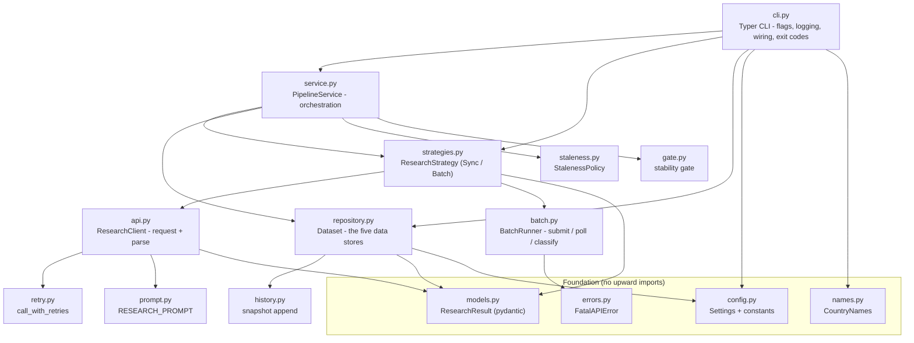
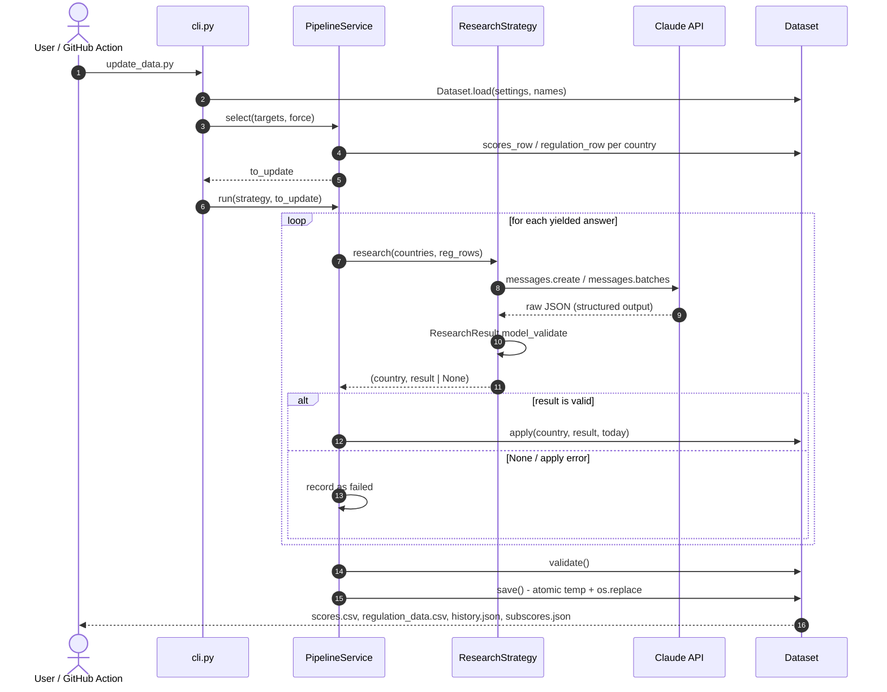
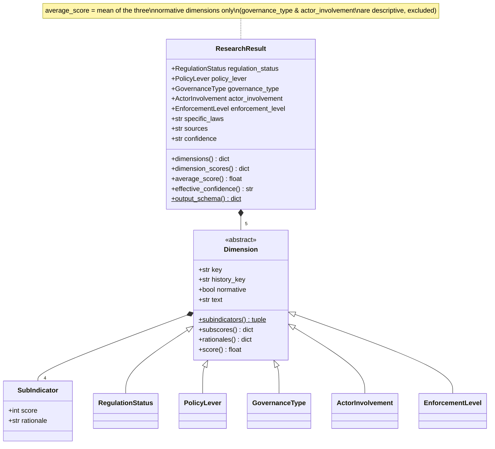
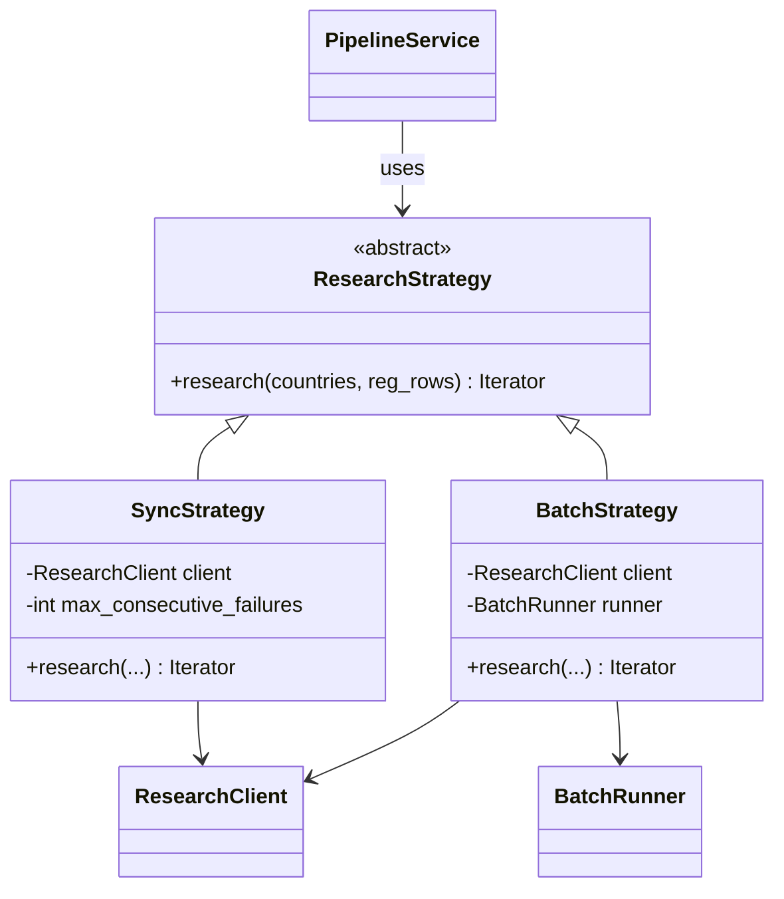
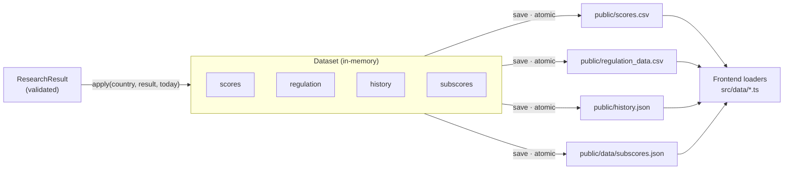
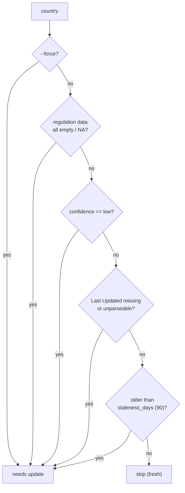
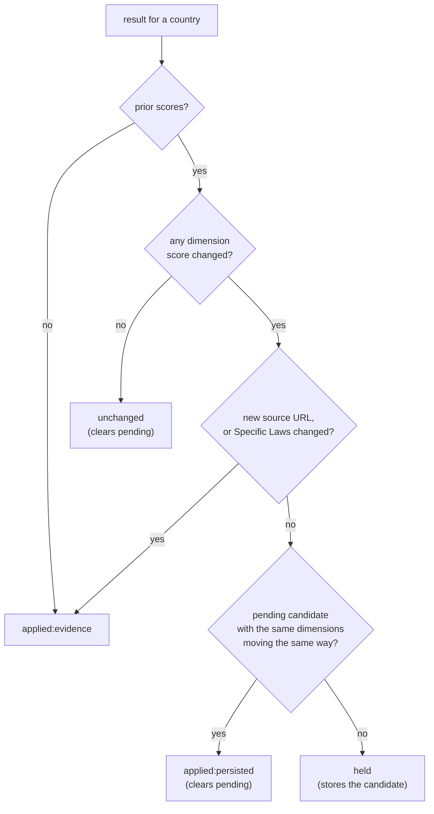
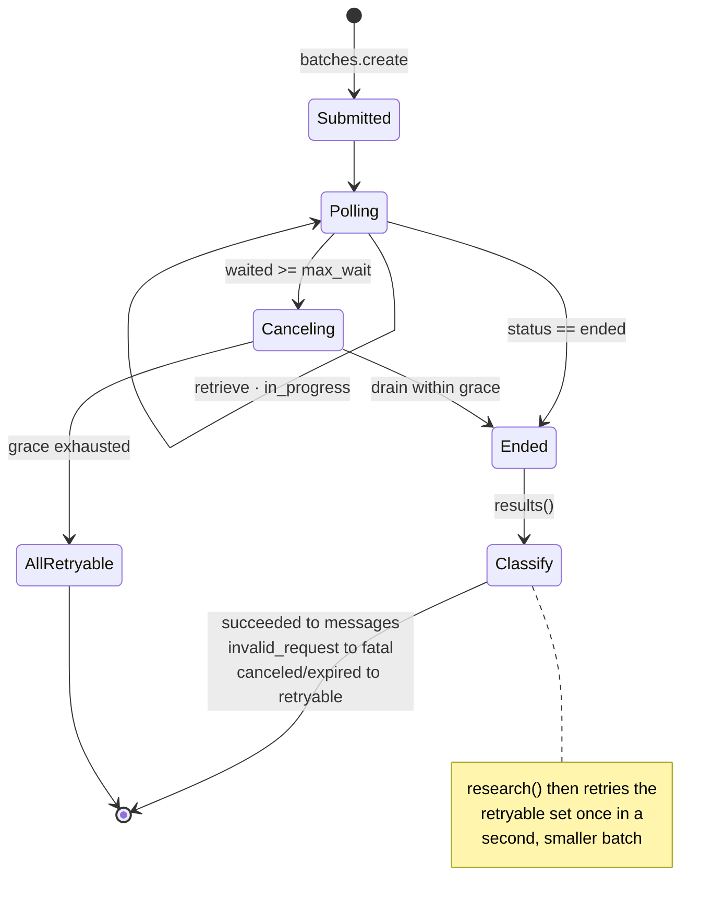
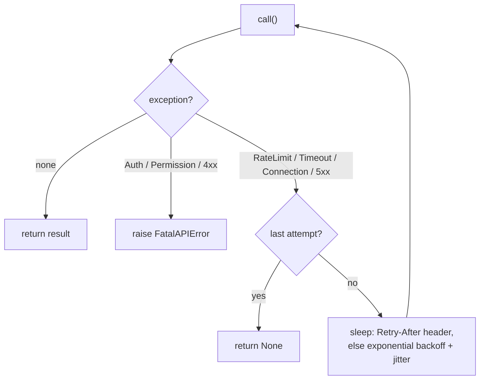

# `regulation_pipeline` - backend architecture

The pipeline researches AI-regulation status for every country via the Claude API
and writes the four data files the frontend renders. It runs weekly from GitHub
Actions and on demand from the CLI.

```bash
python scripts/update_data.py                      # full run: every country, web search, Batches API
python scripts/update_data.py --countries "Germany,France"
python scripts/update_data.py --dry-run            # preview, no writes
python -m regulation_pipeline --help               # (or: update-regulation-data, after pip install -e .)
```

The package is layered around a few classic patterns - **domain model**,
**repository**, **strategy**, and a **service** orchestrator - so each concern has
one home and is testable in isolation. Everything below reflects the code in this
directory.

---

## Layered architecture

Arrows mean *depends on / calls*. The top is the entry point; the bottom is the
shared foundation. Nothing in the foundation imports upward.


```mermaid
flowchart TD
    CLI["cli.py<br/>Typer CLI - flags, logging, wiring, exit codes"]

    CLI --> SVC["service.py<br/>PipelineService - orchestration"]
    CLI --> STRAT
    CLI --> REPO

    SVC --> STRAT["strategies.py<br/>ResearchStrategy (Sync / Batch)"]
    SVC --> REPO["repository.py<br/>Dataset - the five data stores"]
    SVC --> STALE["staleness.py<br/>StalenessPolicy"]
    SVC --> GATE["gate.py<br/>stability gate"]

    STRAT --> API["api.py<br/>ResearchClient - request + parse"]
    STRAT --> BATCH["batch.py<br/>BatchRunner - submit / poll / classify"]

    API --> RETRY["retry.py<br/>call_with_retries"]
    API --> PROMPT["prompt.py<br/>RESEARCH_PROMPT"]

    REPO --> HIST["history.py<br/>snapshot append"]

    STRAT --> MODELS
    API --> MODELS
    REPO --> MODELS
    BATCH --> ERR

    subgraph foundation["Foundation (no upward imports)"]
        MODELS["models.py<br/>ResearchResult (pydantic)"]
        CFG["config.py<br/>Settings + constants"]
        ERR["errors.py<br/>FatalAPIError"]
        NAMES["names.py<br/>CountryNames"]
    end

    CLI --> CFG
    CLI --> NAMES
    REPO --> CFG
```

### Module map

| Module | Responsibility |
|--------|----------------|
| `cli.py` | Typer command: flags, logging setup, dependency wiring, exit codes |
| `service.py` | `PipelineService` - select → research → validate → persist |
| `strategies.py` | `ResearchStrategy` ABC + `SyncStrategy` / `BatchStrategy` |
| `api.py` | `ResearchClient` - build request params, parse the response |
| `batch.py` | `BatchRunner` - Message Batches submit/poll/classify + salvage |
| `retry.py` | Reusable transient-error retry policy |
| `prompt.py` | The research prompt template + rendering |
| `models.py` | `ResearchResult` pydantic model - schema, validation, projections |
| `repository.py` | `Dataset` - load/apply/validate/atomic-save the four stores |
| `history.py` | History snapshot append + change detection |
| `staleness.py` | `StalenessPolicy` - which countries need re-research |
| `gate.py` | Stability gate - decides whether a result's scores may land |
| `digest.py` | Weekly digest: change selection, one structured-output request, `public/digest/` writers (week JSON, index, Atom), `--run <id>` / `--monthly YYYY-MM` regeneration |
| `monthly.py` | Monthly trend piece: history as a step function, the month's movement, bloc series, drift sentence, one structured-output request, `YYYY-MM.json` |
| `charts.py` | Hand-built static SVG (stdlib only): OKLCH colour, line chart with dodged end labels, diverging bar chart |
| `gold.py` | Gold set and drift check: the gold file's contract, the pure agreement metrics, the `drift.json` record, the step-summary block, `--model <id>` comparison CLI |
| `names.py` | `CountryNames` - country-name normalization |
| `config.py` | `Settings` (repo-root paths) + field/threshold/priority constants |
| `errors.py` | `FatalAPIError` |

---

## End-to-end run

A single run, from invocation to written files. The strategy is a **generator**,
so each answer is validated and committed as it arrives - which is what lets a
fatal abort still save the countries completed so far.


```mermaid
sequenceDiagram
    autonumber
    actor U as User / GitHub Action
    participant CLI as cli.py
    participant SVC as PipelineService
    participant ST as ResearchStrategy
    participant API as Claude API
    participant DS as Dataset

    U->>CLI: update_data.py
    CLI->>DS: Dataset.load(settings, names)
    CLI->>SVC: select(targets, force)
    SVC->>DS: scores_row / regulation_row per country
    SVC-->>CLI: to_update
    CLI->>SVC: run(strategy, to_update)

    loop for each yielded answer
        SVC->>ST: research(countries, reg_rows)
        ST->>API: messages.create / messages.batches
        API-->>ST: raw JSON (structured output)
        ST->>ST: ResearchResult.model_validate
        ST-->>SVC: (country, result | None)
        alt result is valid
            SVC->>DS: apply(country, result, today)
        else None / apply error
            SVC->>SVC: record as failed
        end
    end

    SVC->>DS: validate()
    SVC->>DS: save() - atomic temp + os.replace
    DS-->>U: scores.csv, regulation_data.csv, history.json, subscores.json
```

Exit codes: `0` success, `1` some countries failed, `2` fatal (systemic) - with
partial progress saved.

---

## Domain model

`ResearchResult` is the **single source of truth**: it generates the
structured-output JSON schema handed to the API, validates responses, and computes
every projection (dimension means, maturity composite, confidence). Each dimension
is four named sub-indicators (integers 1–5); the dimension score is their mean.


```mermaid
classDiagram
    class ResearchResult {
        +RegulationStatus regulation_status
        +PolicyLever policy_lever
        +GovernanceType governance_type
        +ActorInvolvement actor_involvement
        +EnforcementLevel enforcement_level
        +str specific_laws
        +str sources
        +str confidence
        +dimensions() dict
        +dimension_scores() dict
        +average_score() float
        +effective_confidence() str
        +output_schema() dict$
    }
    class Dimension {
        <<abstract>>
        +str key
        +str history_key
        +bool normative
        +str text
        +subindicators() tuple$
        +subscores() dict
        +rationales() dict
        +score() float
    }
    class SubIndicator {
        +int score
        +str rationale
    }
    Dimension *-- "4" SubIndicator
    Dimension <|-- RegulationStatus
    Dimension <|-- PolicyLever
    Dimension <|-- GovernanceType
    Dimension <|-- ActorInvolvement
    Dimension <|-- EnforcementLevel
    ResearchResult *-- "5" Dimension

    note for ResearchResult "average_score = mean of the three\nnormative dimensions only\n(governance_type & actor_involvement\nare descriptive, excluded)"
```

Scores are typed `Literal[1..5]` (rendered as an `enum` in the schema, since
structured outputs don't support `minimum`/`maximum`) with a `BeforeValidator` that
rejects booleans - so a malformed response raises instead of landing an empty CSV
cell.

---

## Strategy pattern

Two interchangeable research backends behind one generator interface. The service
never branches on sync-vs-batch - it just consumes `(country, result | None)`.


```mermaid
classDiagram
    class ResearchStrategy {
        <<abstract>>
        +research(countries, reg_rows) Iterator
    }
    class SyncStrategy {
        -ResearchClient client
        -int max_consecutive_failures
        +research(...) Iterator
    }
    class BatchStrategy {
        -ResearchClient client
        -BatchRunner runner
        +research(...) Iterator
    }
    ResearchStrategy <|-- SyncStrategy
    ResearchStrategy <|-- BatchStrategy
    PipelineService --> ResearchStrategy : uses
    SyncStrategy --> ResearchClient
    BatchStrategy --> ResearchClient
    BatchStrategy --> BatchRunner
```

- **`SyncStrategy`** - one call per country; aborts the run (`FatalAPIError`) after
  N consecutive failures of *any* kind (transient, unparseable, or schema-invalid).
- **`BatchStrategy`** - submits all countries at once (50% token pricing); per-request
  results mean a bad country costs one country, not the run - so there is no
  consecutive-failure abort.

---

## Repository and the data contract

The five stores always travel together, so one object owns them. `apply` folds a
validated result into them; `save` writes them **atomically** (temp file +
`os.replace`) so an interrupted run can't leave a half-written file. The fifth
store, `public/data/pending.json`, holds the score candidates the stability
gate held for one run.


```mermaid
flowchart LR
    RES["ResearchResult<br/>(validated)"] -->|"apply(country, result, today)"| DS

    subgraph DS["Dataset (in-memory)"]
        direction TB
        S["scores"]
        R["regulation"]
        H["history"]
        SS["subscores"]
    end

    DS -->|save · atomic| F1["public/scores.csv"]
    DS -->|save · atomic| F2["public/regulation_data.csv"]
    DS -->|save · atomic| F3["public/history.json"]
    DS -->|save · atomic| F4["public/data/subscores.json"]

    F1 --> FE["Frontend loaders<br/>src/data/*.ts"]
    F2 --> FE
    F3 --> FE
    F4 --> FE
```

> **Byte-format is a contract.** CSVs use the csv module's `\r\n`; the JSON files
> have no trailing newline; `subscores.json` is `sort_keys=True`; `history.json`
> preserves snapshot key order. An unchanged run re-writes every file byte-for-byte
> identically (there's a test that asserts exactly this). Preserve this when
> touching `repository.py`.

---

## Staleness selection

`PipelineService.select` filters the target countries through `StalenessPolicy`
before any API call - the reference date is injected so a run has one consistent
"today".


```mermaid
flowchart TD
    A["country"] --> B{"--force?"}
    B -- yes --> U["needs update"]
    B -- no --> C{"regulation data<br/>all empty / NA?"}
    C -- yes --> U
    C -- no --> D{"confidence == low?"}
    D -- yes --> U
    D -- no --> E{"Last Updated missing<br/>or unparseable?"}
    E -- yes --> U
    E -- no --> F{"older than<br/>staleness_days (90)?"}
    F -- yes --> U
    F -- no --> K["skip (fresh)"]
```

---

## Stability gate

Weekly re-research of every country produces quarter-point jitter with no
policy cause. `gate.decide` runs before `Dataset.apply` and decides whether the
numeric scores may land. Text fields, confidence, and `Last Updated` always
apply. The gate covers only the dimension scores, the sub-scores, and the
history snapshot.


```mermaid
flowchart TD
    A["result for a country"] --> B{"prior scores?"}
    B -- no --> E["applied:evidence"]
    B -- yes --> C{"any dimension<br/>score changed?"}
    C -- no --> U["unchanged<br/>(clears pending)"]
    C -- yes --> D{"new source URL,<br/>or Specific Laws changed?"}
    D -- yes --> E
    D -- no --> P{"pending candidate<br/>with the same dimensions<br/>moving the same way?"}
    P -- yes --> Q["applied:persisted<br/>(clears pending)"]
    P -- no --> H["held<br/>(stores the candidate)"]
```

- **Evidence rule.** A cited URL that the existing `Sources` column does not
  contain counts as new. URLs compare after the same normalisation as
  `sources.py` (no scheme, no `www.`, no trailing slash). `Specific Laws`
  compares after whitespace normalisation. A confidence drop is not evidence.
- **Persistence rule.** A held candidate lives in `public/data/pending.json`
  as `{country, candidate_scores, first_seen}`. The next result for that
  country applies when it moves the same dimensions in the same direction.
  A result that reverts to the stored scores clears the candidate. A result
  that moves differently replaces it. The window is two consecutive results.
- **Provenance.** The run log carries one line per country with the rule:
  `applied:evidence`, `applied:persisted`, `applied:ungated`, `held`, or
  `unchanged`. The counts go to the run log (`Gate:` line), the GitHub step
  summary, and `research_runs.notes`. An applied move of 0.75 or more on any
  dimension appears under "Review these" with old, new, and the new sources.
- **Mirror.** The Supabase mirror receives the gated scores row, so the
  database never runs ahead of the static files.
- **Escape hatch.** `--no-gate` applies every score. On a full run it needs
  `--break-reason "<text>"`, which appends `{date, model, prompt_version,
  reason}` to the `breaks` list in `history.json`. The frontend marks the date
  on the timeline and labels changes on that date as a recalibration. Past
  snapshots are never re-scored or offset.
- **Dry run.** `--dry-run` prints the gate's standing per country: no prior
  scores, gate on, or held since a date with the pending move.

---

## Batch lifecycle

`BatchRunner` submits, polls to completion, and classifies each result. On timeout
it **cancels and salvages** the requests that already succeeded (and were already
billed) instead of discarding the run.


```mermaid
stateDiagram-v2
    [*] --> Submitted: batches.create
    Submitted --> Polling
    Polling --> Polling: retrieve · in_progress
    Polling --> Ended: status == ended
    Polling --> Canceling: waited >= max_wait
    Canceling --> Ended: drain within grace
    Canceling --> AllRetryable: grace exhausted
    Ended --> Classify: results()
    Classify --> [*]: succeeded to messages<br/>invalid_request to fatal<br/>canceled/expired to retryable
    AllRetryable --> [*]

    note right of Classify
        research() then retries the
        retryable set once in a
        second, smaller batch
    end note
```

---

## Retry policy

`call_with_retries` wraps a single API call. The SDK's own retries are disabled
(`max_retries=0`) so these are the only attempts and every one is logged.


```mermaid
flowchart TD
    A["call()"] --> B{"exception?"}
    B -- none --> R["return result"]
    B -- "Auth / Permission / 4xx" --> F["raise FatalAPIError"]
    B -- "RateLimit / Timeout / Connection / 5xx" --> C{"last attempt?"}
    C -- yes --> N["return None"]
    C -- no --> D["sleep: Retry-After header,<br/>else exponential backoff + jitter"]
    D --> A
```

`Retry-After` is honored on **every** retryable error, including 5xx/overloaded.

---

## Supabase layer (`db/`) and the evidence layer (`evidence/`)

The static files stay the persistence contract (everything above is
unchanged); Supabase is the system of record's queryable twin plus what files
can't hold - evidence records, an accumulating sources database, and per-run
provenance.

- **Mirror (`db/mirror.py`)** - an optional collaborator of
  `PipelineService` (`mirror=` constructor arg), deliberately OUTSIDE
  `Dataset` so the byte contracts and the idempotency test are untouched.
  The service calls `begin(attempted)` before researching, `record(...)`
  after each successful apply, and `finish(...)` after `dataset.save()`
  (including the fatal-error partial-save path) - every call wrapped so a
  mirror failure downgrades to a warning and can never change a run's
  outcome or exit code. The flush upserts `country_scores` /
  `country_summaries`, REPLACES `score_history` per recorded country
  (`history.py` mutates the last snapshot's date in place, so append-only
  would drift), and feeds every cited URL into `sources` /
  `country_sources` with the run id. `research_runs` records trigger,
  model, strategy, prompt version, grounded flag, git SHA, counts, and
  cumulative token usage.
- **Client (`db/client.py`)** - a thin httpx PostgREST wrapper (select /
  insert / upsert / update / delete), testable with `httpx.MockTransport`.
  Upserts must never include generated columns like `id` -
  merge-duplicates updates every supplied column.
- **Seed (`db/seed.py`)** - one-shot bootstrap from the static files:
  `--emit-sql DIR` writes chunked idempotent SQL (FKs resolved by
  name/url subselects), `--direct` applies via PostgREST.
- **Evidence (`evidence/`)** - `OecdGaiinAdapter` walks the OECD.AI Policy
  Navigator API (no server-side filtering exists; delta detection is
  client-side against `updated_at`), `CountryResolver` matches ISO3 →
  canonical name → None (never fuzzy; unmatched records are stored
  unlinked with the raw label), and `sync.py` upserts on
  `(source, external_id)` - never deleting. CLI:
  `python -m regulation_pipeline.evidence probe|sync`. A network failure
  is a warned no-op so the surrounding data run survives an OECD outage.
- **Grounded mode** - `prompt.render_grounded_prompt` injects a capped
  verified-evidence block (≤15 most recent initiatives, overviews ≤400
  chars); the rubric and structured-output schema are identical to the
  plain prompt, so `models.py` and everything downstream are untouched.
  `ResearchClient` takes an `evidence_provider`; countries without
  evidence fall back to the plain prompt. Enable with `--grounded`.

## Weekly digest (`digest.py`)

A post-run step that stays out of the service. `PipelineService.run` returns a
`RunResult` whose `changes` hold, per applied country, the scores and
regulation rows the result replaced (`CountryChange`, read after the gate
applied, so a held result shows no score movement) and the gate rule that
decided it. `digest.py` reduces those to the countries worth reporting, asks
Claude for the prose once, and writes `public/digest/`.

- **Selection.** A country is covered when a gate-applied dimension score
  moved, the `Specific Laws` text changed after whitespace normalisation, or
  confidence rose to `high` with a source URL the old row did not have. On a
  calibration-break run (`--no-gate --break-reason`) score-only changes are
  left out and the lead opens with the recalibration sentence (PRD 01,
  addendum A).
- **Generation.** One request on the run's model with structured output
  (`DigestText.output_schema()`, the same pydantic pattern as `ResearchResult`).
  The prompt forbids claims without a source from the supplied list, em dashes,
  and unverifiable adjectives. `validate_items` drops any item that cites a URL
  outside its country's source list, so the digest can never link to a source
  the run did not find.
- **Files.** `YYYY-Www.json` (ISO week of the run date; lead, items, and the
  raw deltas), `index.json` (weeks, newest first), `feed.xml` (Atom, one entry
  per week). An empty run writes a one-line "no changes" week without a request.
- **When it runs.** `--digest/--no-digest`; the default is on for scheduled
  runs (`GITHUB_EVENT_NAME=schedule`). A digest failure is a warning: the data
  files are already saved and the exit code is unchanged.
- **Regeneration.** `python -m regulation_pipeline.digest --run <id>` rebuilds a
  run's changes from Supabase. `score_history.run_id` marks the snapshots a run
  introduced (the mirror keeps earlier snapshots' ids when it replaces a
  country's history), so score change points are exact. The regulation text has
  no history in the database, so regenerated digests cover score changes only.

## Monthly trend piece (`monthly.py`, `charts.py`)

Weekly digests report events; the monthly piece shows direction. On a
scheduled run, after the weekly digest, `write_monthly_if_due` writes
`public/digest/YYYY-MM.json` for the previous calendar month when that file
does not exist yet and the month has at least one week file. The first
scheduled run of a month therefore writes it, and a later run of the same
month retries if that one failed. `index.json` lists it under `months` with
`kind: "monthly"`; the Atom feed carries it as an entry (text only: feed
readers strip inline SVG); `changes.html?month=YYYY-MM` renders it.

- **History as a step function.** `history.json` stores change points, and an
  unchanged re-research advances the last snapshot's date (`history.py`), so a
  snapshot's date is its last confirmation, not the day it took effect. A
  "latest snapshot on or before the day" lookup would therefore push most
  changes into the month of the latest run. `country_steps` dates each change
  on the first known run (history dates, week files, breaks, drift rows) after
  the previous snapshot's date: exact under weekly full runs, the earliest
  possible date otherwise. The first snapshot is carried back, as the app's
  timeline does.
- **Charts.** Three static SVGs built in Python with the standard library
  (`charts.py`) and embedded in the JSON with a preformatted table and the raw
  data: each bloc's mean maturity index at 14 weekly points over the 13 weeks
  to the month's last day, the net movement of each dimension across all
  countries in the month (rises and falls summed separately), and the ten
  largest month-over-month movers on the maturity index. Text and rules use
  `currentColor`, so one file reads in both themes; series colours come from
  the map legend's OKLCH endpoints. Each bloc keeps a fixed step of that ramp
  (`BLOC_SLOTS`), chosen so blocs at neighbouring levels get distant steps, and
  every line is labelled at its end.
- **Calibration breaks.** Changes dated on a `history.json` break are left
  out of the month's movement; the bloc chart marks the break with a rule.
- **Narrative.** One request on the run's model with structured output
  (`MonthlyText`: `{lead, sections: [{heading, text, sources}]}`) over the
  month's digest items and the chart data. `validate_sections` drops any
  section that cites no source or a URL that no digest item of the month
  cited. A month with no movement and no items gets a fixed lead and no
  request.
- **Drift.** One computed sentence on the month's `drift.json` rows (runs,
  within-one range, runs below the 0.8 warning), linked to the drift
  dashboard once `drift.html` exists, else to `drift.json`.
- **Backfill.** `python -m regulation_pipeline.digest --monthly YYYY-MM`
  regenerates a finished month from the files on disk (needs only
  `ANTHROPIC_API_KEY`).

## Gold set and drift check (`gold.py`)

Nothing else measures whether the pipeline scores correctly, or whether a
model or prompt change moved the calibration. `public/data/gold_set.json`
holds ten countries across the maturity range with a hand-checked score for
each of the 20 sub-indicators (five dimensions times four), a one-line
justification per dimension, the sources used, and a `status` of `draft` or
`verified` (with `verified_on`). `load_gold_set` validates the file against
the sub-indicator names in `models.py`, so a typo in the gold file fails
loudly.

- **What is compared.** `PipelineService.run` keeps every validated result
  in `RunResult.raw_results`, before the stability gate, so the check reads
  what the model returned for a held country too. It costs no extra API
  calls on a scheduled run. `gold.compare` is pure: it returns the mean
  absolute error per dimension, the share of sub-indicators within one
  point, and the largest single deviation with where it happened, plus the
  gold countries the run did not cover.
- **Record.** One row per run is appended to `public/data/drift.json`
  (`{run_id, date, model, prompt_version, countries_compared,
  countries_missing, mae_by_dimension, within_one, max_dev, max_dev_at}`)
  and mirrored to the Supabase `gold_checks` table
  (`supabase/migrations/0007_gold_checks.sql`). The workflow commits the
  file with the other data files. A run covering none of the gold
  countries records nothing.
- **Summary.** The metrics go to the run log (`gold:` line) and to the
  GitHub step summary. When `within_one` is below 0.8 both start with
  "Calibration warning". The check never changes the exit code: a
  malformed gold file or an unwritable drift file is a warning.
- **Model comparison.** `python -m regulation_pipeline.gold --model <id>`
  researches only the gold countries with that model (synchronous by
  default; `--batch` for the 50% pricing; `--no-search` to drop web search)
  and prints the metrics, or the drift row with `--json`. It writes neither
  the dataset nor `drift.json`.

## Testing & tooling

```bash
python -m pytest        # tests/pipeline/ - 90+ tests, no network (fakes throughout)
ruff check scripts/regulation_pipeline
pip install -e .        # installs the package + update-regulation-data console script
```

Every layer has a seam for testing: `Settings(root=tmp_path)` redirects all I/O,
strategies take a stub `ResearchClient`, the batch poll loop takes an injected
`sleep`, and the retry policy takes an injected clock. The CI workflow
(`.github/workflows/update-data.yml`) commits whatever data completed even when a
run reports failures, so a single failed country never discards the month's work.
