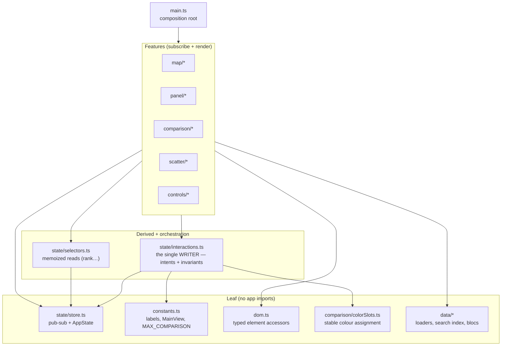
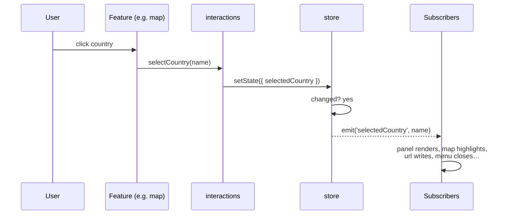

# Frontend Architecture

Vanilla TypeScript + D3 over a static `index.html`, built with Vite. No
framework — the choropleth is the protagonist and the bundle stays small
(~57 kB gzip). This document is the frontend counterpart to
[`scripts/regulation_pipeline/README.md`](../scripts/regulation_pipeline/README.md):
it names the patterns the code leans on and the seams that keep the concerns
separable and testable.

The through-line: **all state change flows one way.** A user gesture dispatches
a named *intent*; the intent is the only thing that writes the store; the store
notifies subscribers by key; subscribers re-render their slice of the DOM.
Derived values are read through *selectors*, never recomputed inline.

## Layering

Dependencies point downward. Nothing below the orchestrator imports a feature,
so there are no import cycles (`madge --circular src/` is clean).

## The patterns

### Observer / pub-sub — `state/store.ts`
A single `AppState` object plus a per-key listener registry. `getState()`
returns it deeply read-only (mutation is a compile error); `setState(patch)`
merges and **emits only for keys whose value actually changed** (no-op writes
don't fan out re-renders); `on(key, handler)` subscribes and returns an
unsubscribe. Listeners are typed per key (`Listener<K>`), so a handler for
`selectedCountry` receives `string | null`, not `unknown`.

### Single-writer orchestrator — `state/interactions.ts`
The frontend's analogue of the backend `PipelineService`. Every transition that
carries an invariant lives here as a named intent, and **intents are the only
callers of `setState` for view/selection/comparison state**:

- selection — `selectCountry`, `stepCountry` (arrow nav with wraparound)
- comparison membership — `addToComparison` / `removeFromComparison` /
  `toggleComparison` / `clearComparison` / `restoreComparison`
- the view FSM — `showMap` / `openScatter` / `toggleScatter` /
  `openComparison` / `escapeMainView`

Because it depends only on the store, constants, and the colour-slot leaf, it
never forms a cycle with the features that call it. The rules that used to be
smeared across control modules ("opening scatter leaves comparison", "a
comparison needs ≥2 countries", "Esc backs out one layer") now have one home.

### Finite-state view — `MainView`
The main area is one field, `mainView: 'map' | 'scatter' | 'comparison'`
(`constants.ts`), not two independent booleans. "Both overlays open at once" is
unrepresentable, and `setMainView` is the single writer, so switching to one
view implicitly leaves the others — no manual "close the other" dance.

### Selectors (memoized derived state) — `state/selectors.ts`
The read-side counterpart to the orchestrator. `maturityRank(country)` derives
the whole ranking once per data load (memoized on the `scoreData` reference)
instead of the panel rebuilding an O(n²) scan on every selection. New
derivations used in more than one place belong here.

### Mapper / repository — `data/*`
`loader.ts` maps CSV rows to typed domain objects (`ScoreEntry`,
`RegulationEntry`) and validates at the boundary (non-numeric/out-of-range →
`null`, never `NaN`). `history.ts`, `blocs.ts`, `subscores.ts`, and
`searchIndex.ts` are the other read models. This is the layer that most
resembles the backend's `Dataset` repository.

### Facade barrels — `map/index.ts`, `comparison/index.ts`, `scatter/index.ts`
Each feature exposes a curated surface and hides its internals (the D3 renderer,
the radar builder, the colour slots). Cross-feature imports go through the
barrel, not into private files.

### Typed DOM seam — `dom.ts`
`el<T>(id)` (required; throws with the id if missing) and `maybeEl<T>(id)`
(optional) replace unchecked `getElementById(x) as HTMLInputElement` casts. One
place to reason about the element contract.

### Serialization seam — `controls/url.ts`
State ⇄ URL query string, so any view is a shareable link. `buildPermalink`
omits defaults (and the theme, for citations); `applyUrlState` restores through
the same intents, with an explicit precedence (comparison > scatter > country).

## Data flow

## Module map

| Path | Role | Pattern |
|------|------|---------|
| `state/store.ts` | `AppState` + typed pub-sub | Observer, single source of truth |
| `state/interactions.ts` | intents + invariants (the only writer) | Orchestrator / "Service" |
| `state/selectors.ts` | memoized derived reads | Selector |
| `constants.ts` | labels, `MainView`, `MAX_COMPARISON` | shared contract |
| `dom.ts` | typed element access | seam |
| `data/*` | CSV/JSON → typed domain | Mapper / repository |
| `map/*` | choropleth render, zoom, tooltip, legend | imperative D3 |
| `panel/*` | country detail | subscriber view |
| `comparison/*` | staging strip + full comparison | subscriber view (+ `colorSlots` leaf) |
| `scatter/*` | dimension explorer | subscriber view |
| `controls/*` | search, filter, blocs, export, timeline, url, theme, menu, help, cite | subscriber views |
| `main.ts` | boot + wiring | composition root |

## Where the rules live

- **What can transition, and when** → `state/interactions.ts` (nowhere else
  should write `mainView`, comparison membership, or drive Esc layering).
- **What a value means once derived** → `state/selectors.ts`.
- **What the data must look like** → `data/loader.ts` (the validation boundary).
- **What DOM ids exist** → `dom.ts` accessors + `index.html`.

## Extending

- **Add UI state**: add the field to `AppState` (+ default), then `on(key, …)`
  where it matters. If a change has to enforce a rule, add an *intent* rather
  than calling `setState` from the feature.
- **Add a derived value used in >1 place**: add a memoized selector.
- **Add a view/overlay**: extend `MainView` and the `setMainView` guard; the
  FSM keeps mutual exclusion automatic.

## Known incremental migrations

- `dom.ts` is adopted for the unchecked casts; the remaining
  `getElementById(...)!` sites (correct type, just non-null) can move to `el()`
  opportunistically.
- Rendering is deliberately imperative. If the panel/comparison DOM churn ever
  justifies it, a ~30-line tagged-template helper — not a framework — is the
  intended next step; the map stays hand-written D3.
