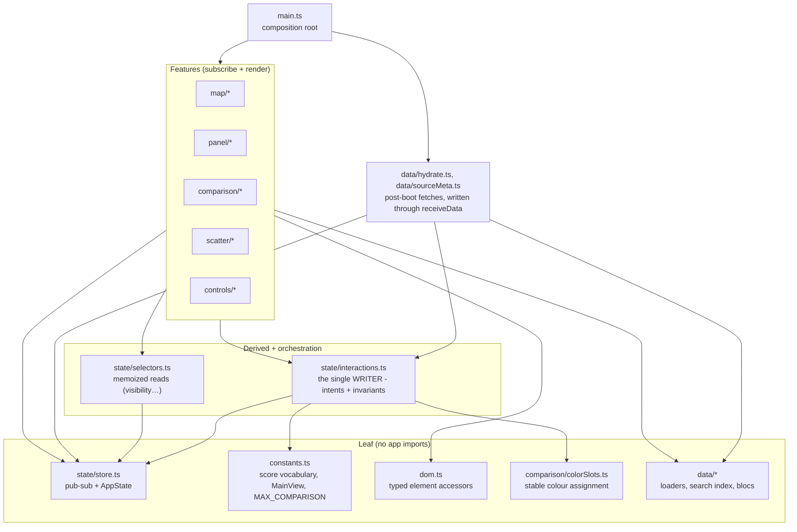
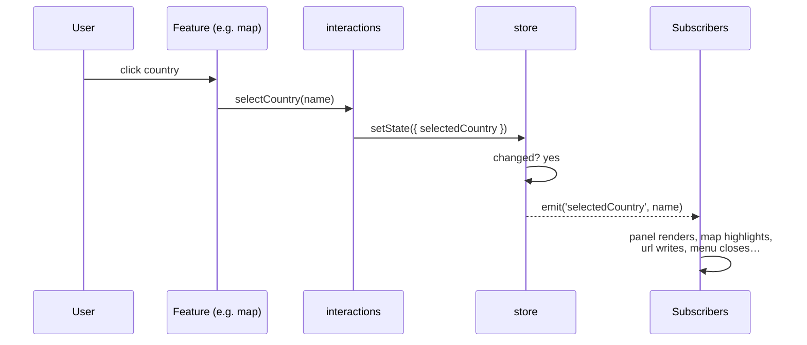

# Frontend Architecture

Vanilla TypeScript + D3 over a static `index.html`, built with Vite. No
framework - the choropleth is the protagonist and the bundle stays small
(~57 kB gzip). This document is the frontend counterpart to
[`scripts/regulation_pipeline/README.md`](../scripts/regulation_pipeline/README.md):
it names the patterns the code leans on and the seams that keep the concerns
separable and testable.

The through-line: **all state change flows one way.** A user gesture dispatches
a named *intent*; the intent is the only thing that writes the store; the store
notifies subscribers by key; subscribers re-render their slice of the DOM.
Derived values are read through *selectors*, never recomputed inline.

## Layering

Dependencies point downward. Nothing below the orchestrator imports a feature,
so there are no import cycles (`madge --circular --extensions ts src/` is clean).

```mermaid
flowchart TD
  subgraph Leaf["Leaf (no app imports)"]
    store["state/store.ts<br/>pub-sub + AppState"]
    constants["constants.ts<br/>score vocabulary, MainView, MAX_COMPARISON"]
    dom["dom.ts<br/>typed element accessors"]
    colorSlots["comparison/colorSlots.ts<br/>stable colour assignment"]
    dataLayer["data/*<br/>loaders, search index, blocs"]
  end

  hydrateLayer["data/hydrate.ts, data/sourceMeta.ts<br/>post-boot fetches, written through receiveData"]

  subgraph Derive["Derived + orchestration"]
    selectors["state/selectors.ts<br/>memoized reads (visibility…)"]
    interactions["state/interactions.ts<br/>the single WRITER - intents + invariants"]
  end

  subgraph Features["Features (subscribe + render)"]
    map["map/*"]
    panel["panel/*"]
    comparison["comparison/*"]
    scatter["scatter/*"]
    controls["controls/*"]
  end

  root["main.ts<br/>composition root"]

  interactions --> store
  interactions --> constants
  interactions --> colorSlots
  selectors --> store
  Features --> interactions
  Features --> selectors
  Features --> store
  Features --> dom
  Features --> dataLayer
  hydrateLayer --> interactions
  hydrateLayer --> store
  hydrateLayer --> dataLayer
  root --> Features
  root --> hydrateLayer
```

Two modules under `data/` are not leaves: `hydrate.ts` and `sourceMeta.ts`
fetch after boot and write what they load through the `receiveData` intent,
so they sit beside the features, not in the leaf layer.

## The patterns

### Observer / pub-sub - `state/store.ts`
A single `AppState` object plus a per-key listener registry. `getState()`
returns it deeply read-only (mutation is a compile error); `setState(patch)`
merges and **emits only for keys whose value actually changed** (no-op writes
don't fan out re-renders); `on(key, handler)` subscribes and returns an
unsubscribe. Listeners are typed per key (`Listener<K>`), so a handler for
`selectedCountry` receives `string | null`, not `unknown`.

### Single-writer orchestrator - `state/interactions.ts`
The frontend's analogue of the backend `PipelineService`. Every transition that
carries an invariant lives here as a named intent, and **intents are the only
callers of `setState` outside `state/`**, even for writes that carry no rule
yet, so a rule added later has one home and no control can skip it
(`tests/singleWriter.test.js` fails on a `setState` import anywhere else):

- selection - `selectCountry`, `stepCountry` (arrow nav with wraparound)
- committed search - `commitSearch` / `clearSearch`
- comparison membership - `addToComparison` / `removeFromComparison` /
  `toggleComparison` / `clearComparison` / `restoreComparison` /
  `startComparison` (a fresh set from the panel's "Compare with" chips,
  capped at `MAX_COMPARISON`, opened at once)
- the view FSM - `setMainView` (the single writer of `mainView`) /
  `showMap` / `openScatter` / `toggleScatter` / `openComparison` /
  `escapeMainView`
- the map's lens and date - `selectAttribute` / `setTimelineDate` (the
  frontier lens, PRD 15, is accepted only once some country has a frontier
  track; `receiveData` returns the lens and the scatter axes to their
  defaults when replacement data has none)
- filters - `selectBloc` (known blocs only) / `setScoreRange` /
  `setConfidenceFilter` / `setOfficialOnly` / `setEvidenceFilter` /
  `resetFilters` (one write; leaves the uncertainty hatch alone) /
  `setShowUncertainty`
- the scatter axes - `setScatterAxes`
- data - `receiveData`, typed to the data slices only (`DataPatch`): the boot
  loaders in `main.ts`, Supabase hydration (`data/hydrate.ts`) and source
  titles (`data/sourceMeta.ts`) write through it

Because it depends only on the store, constants, and the colour-slot leaf, it
never forms a cycle with the features that call it. The rules that used to be
smeared across control modules ("opening scatter leaves comparison", "a
comparison needs ≥2 countries", "Esc backs out one layer") now have one home.

### Finite-state view - `MainView`
The main area is one field, `mainView: 'map' | 'scatter' | 'comparison'`
(`constants.ts`), not two independent booleans. "Both overlays open at once" is
unrepresentable, and `setMainView` is the single writer, so switching to one
view implicitly leaves the others - no manual "close the other" dance.

### Selectors (memoized derived state) - `state/selectors.ts`
The read-side counterpart to the orchestrator: derived values are memoized
on their source reference instead of being recomputed on every render. New
derivations used in more than one place belong here. (There is no rank
selector: PRD 16 removed rank from every surface, since a higher score is
not a better one.)

`visibleCountrySet()` is the single definition of "which countries pass the
active filters" (score range + bloc + confidence + official-sources +
evidence; a country with insufficient evidence on the current attribute,
a row with a null value, passes the range only while it spans the full
scale, see `scoreRangeIsFull()`) - the export scope, scatter dimming, and map opacity all read it,
after three diverging copies let the export forget the bloc filter entirely.
`passesCountryFilters()` is its score-independent half (the map range-checks
per-datum because timeline playback filters historical snapshots;
`visibleCountriesIn(rows)` is the same rule over other rows, which the
export applies to its rows as of a past date), and `scoresAtDate()`
memoizes the snapshot resolution the map, the panel and the export share
while the timeline is scrubbed. `isLowConfidenceAtDate()` builds on it: the
map's low-confidence hatch follows the snapshot's recorded confidence at the
scrubbed date, else the current rating (`confidenceFallsBackAtDate()` tells
the legend when that fallback is in play).

### Mapper / repository - `data/*`
`loader.ts` maps CSV rows to typed domain objects (`ScoreEntry`,
`RegulationEntry`) and validates at the boundary (empty/non-numeric/out-of-range →
`null`, never `NaN`). A `null` on an existing row is "insufficient evidence"
(rubric v3.1), a missing row is "no data": `isInsufficient()` in
`constants.ts` is the one test, and `map/fill.ts` the one fill rule. `history.ts`, `blocs.ts`, `subscores.ts`, and
`searchIndex.ts` are the other read models; `evidence.ts` normalizes the
per-country evidence record `subscores.ts` carries (PRD 14) and derives the
panel sentence and the Evidence filter predicate; `peers.ts` derives the
panel's peer sets (bloc, similar implementation, similar profile) as pure
functions over the score rows. This is the layer that most resembles the
backend's `Dataset` repository.

### Facade barrels - `map/index.ts`, `comparison/index.ts`, `scatter/index.ts`
Each feature exposes a curated surface and hides its internals (the D3 renderer,
the radar builder, the colour slots). Cross-feature imports go through the
barrel, not into private files.

### Typed DOM seam - `dom.ts`
`el<T>(id)` (required; throws with the id if missing) and `maybeEl<T>(id)`
(optional) replace unchecked `getElementById(x) as HTMLInputElement` casts and
non-null `getElementById(x)!` lookups. One place to reason about the element
contract; a bare `getElementById` is left only where the element is optional
and the call site checks for null.

### Serialization seam - `controls/url.ts`
State ⇄ URL query string, so any view is a shareable link. `buildPermalink`
omits defaults (and the theme, for citations); `applyUrlState` restores through
the same intents, with an explicit precedence (comparison > scatter > country).
Params: `country`, `compare`, `mode`, `date`, `bloc`, `min`/`max` (score
range), `conf`/`official`/`evidence` (country filters), `q` (committed search),
`scatter`, `theme`. A `theme` param applies for that visit only (the boot
script and `applyUrlState` set `data-theme` but never write localStorage;
only the theme toggle persists a choice), so opening a shared link does not
change the reader's stored theme. The header Share popover (`controls/share.ts`) surfaces
the permalink + formatted citations for ANY view, no selection required.
`showUncertainty` (the map hatch toggle) is a per-browser preference in
`localStorage` and, unlike `theme`, is not carried in the URL, so a shared
link opens with the reader's own setting.

### Static-first + Supabase hydration - `data/supabase.ts`, `data/hydrate.ts`
The app boots from the static files, always. Supabase is progressive
enhancement behind `restGet()` (null on any failure): post-boot hydration
replaces store data only when the database is STRICTLY newer than the static
snapshot; source titles (`data/sourceMeta.ts`) and the per-country Policy
Initiatives section (`panel/initiatives.ts`) render only when their fetches
succeed (no code writes `sources.title` yet, so sources still render as
hostnames). Unconfigured builds skip the network entirely - which is what
keeps CI hermetic (`tests/e2e/supabase.spec.ts` proves both halves with route
mocks).

### Committed search - `searchQuery` + `panel/searchResults.ts`
Typing in the search box is dropdown-local; committing ("See all N results" /
`?q=`) writes `searchQuery` via the `commitSearch`/`clearSearch` intents. The
results module owns the map dimming while a query is committed (the dropdown's
transient highlight defers to it), renders the full match list with export,
and jumps to the matched panel field via `sections.highlightPanelField`. The
derived match list is memoized module-locally - derived data stays out of the
store.

## Data flow

```mermaid
sequenceDiagram
  participant U as User
  participant F as Feature (e.g. map)
  participant I as interactions
  participant S as store
  participant Subs as Subscribers

  U->>F: click country
  F->>I: selectCountry(name)
  I->>S: setState({ selectedCountry })
  S->>S: changed? yes
  S-->>Subs: emit('selectedCountry', name)
  Subs->>Subs: panel renders, map highlights,<br/>url writes, menu closes…
```

## Module map

| Path | Role | Pattern |
|------|------|---------|
| `state/store.ts` | `AppState` + typed pub-sub | Observer, single source of truth |
| `state/interactions.ts` | intents + invariants (the only writer) | Orchestrator / "Service" |
| `state/selectors.ts` | memoized derived reads | Selector |
| `constants.ts` | the score vocabulary (`ATTRIBUTES`, `GROUPS`: label, lens, question, endpoints, what a score does not claim), `MainView`, `MAX_COMPARISON` | shared contract |
| `data/meaning.ts` | the strings each surface shows about a score (tooltip line, legend caption, live region, bloc card labels, sub-indicator level meanings) | pure derivation |
| `dom.ts` | typed element access | seam |
| `data/*` | CSV/JSON → typed domain | Mapper / repository |
| `data/countryIso.ts` | `country_iso.json`: ISO codes for the panel, ISO numeric → dataset name for the map join | Mapper |
| `map/*` | choropleth render, zoom, tooltip, the HTML legend, the three ramps (`ramp.ts`) | imperative D3 |
| `map/countryTable.ts` | the map as a keyboard and screen-reader table (#139) | subscriber view |
| `map/geometryNames.ts` | gives world-atlas geometries the dataset's country names via their ISO numeric ids | Mapper |
| `map/smallStates.ts` | small states the 1:110m atlas has no shape for (`public/data/small_states.json`) as Point features the renderer draws as constant-size `.country` markers (#104) | Mapper |
| `panel/*` | country detail (the frontier risk governance block in `panel/frontier.ts`) | subscriber view |
| `comparison/*` | staging strip + full comparison | subscriber view (+ `colorSlots` leaf) |
| `scatter/*` | dimension explorer | subscriber view |
| `controls/*` | search, filter, blocs, export, timeline, url, theme, menu, help ("How to read this map"), cite, share, print brief, issue report, this-week strip | subscriber views |
| `charts/*` | the drift dashboard's D3 small multiples (`charts/drift.ts`) | imperative D3 |
| `main.ts` | boot + wiring | composition root |
| `changes.ts` | `changes.html` entry: renders the weekly digest from `public/digest/` | page entry |
| `drift.ts` | `drift.html` entry: the drift dashboard | page entry |
| `apiDocs.ts` | `api-docs.html` entry: self-hosted Swagger UI over `public/openapi.json` | page entry |

## Where the rules live

- **What can transition, and when** → `state/interactions.ts` (nowhere else
  writes the store, and nowhere else drives Esc layering).
- **What a value means once derived** → `state/selectors.ts`.
- **What the data must look like** → `data/loader.ts` (the validation boundary).
- **What DOM ids exist** → `dom.ts` accessors + `index.html`.

## Extending

- **Add UI state**: add the field to `AppState` (+ default), an *intent* in
  `interactions.ts` that writes it (features never call `setState`), then
  `on(key, …)` where it matters.
- **Add a derived value used in >1 place**: add a memoized selector.
- **Add a view/overlay**: extend `MainView` and the `setMainView` guard; the
  FSM keeps mutual exclusion automatic.

## Known incremental migrations

- Rendering is deliberately imperative. If the panel/comparison DOM churn ever
  justifies it, a ~30-line tagged-template helper - not a framework - is the
  intended next step; the map stays hand-written D3.
